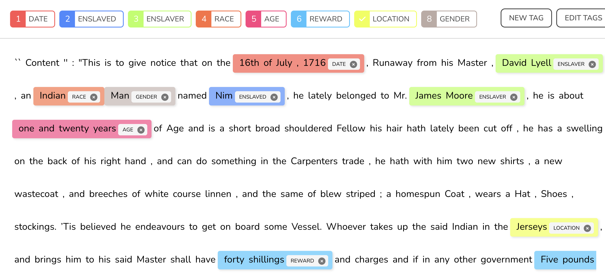
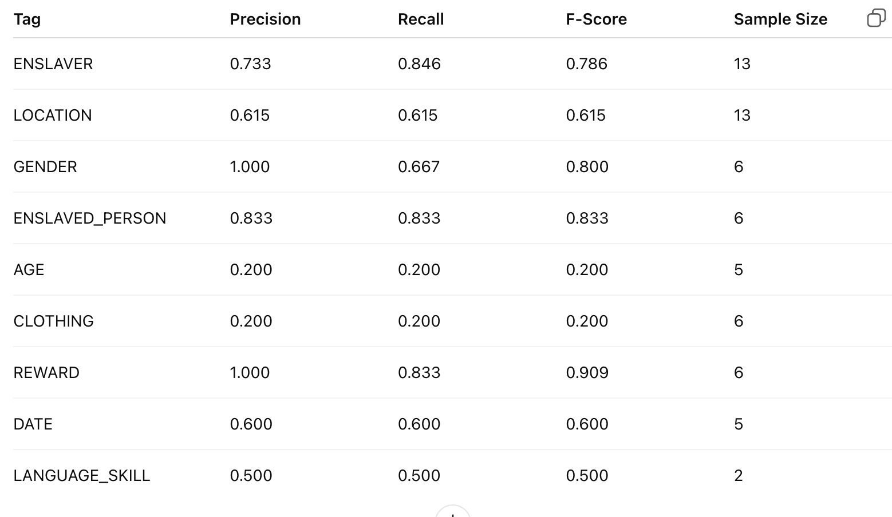
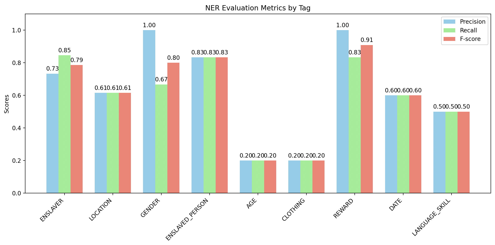

I have started a journey to explore numerous machine learning tools specifically to research African American history and document where these tools fall short in historical research. 

SpaCy - the most well-known NER library has a few already trained models to run NER on textual documents. 

The smallest model in English language have the 87% accuracy rate overall. 
SMALL MODEL - First Ad:

Sixth Ad: 

Since I wanted a more detailed entity separation, such as enslaved and enslaver instead of simply people, I have decided to train a simple SPaCY model myself.

First, I started with manually annotating a few of the ads on a web annotator. 
I have decided on 8 tags that would be necessary to be in the metadata. 
Annotator: https://github.com/tecoholic/ner-annotator 

To annotate, I picked 30 slave advertisements (every fifth one when listed chronically)
After manually tagging, I split 20% of the tagged advertisements to be the training data. I fine-tuned a Spa-cy Model. 

Fine-tuning the SpaCy standard English model was limiting in two ways: 
- I had limited examples of annotated runaway slave advertisements as I was working with around 500 primary sources, which is a lot of close reading, but not enough to fine-tune a model, as I had separated them for training data, testing data, and validation. 
- Second, I had to be extremely precise with my manual tagging and make sure my dataset was standardized and refined well -- again, hard with historical documents as they often come with a variety of speech patterns and often lack a standard English (also inconsistencies with transcription, print quality of that time, etc.) To make sure that the machine knows every possible way of writing the date, location, or even the age, I had to tag a lot more sources to incorporate that diversity into the training data, which was not possible due to the limited manpower and number of primary sources.
Because of these problems, the tests with conventional methods had low precision and accuracy levels.

